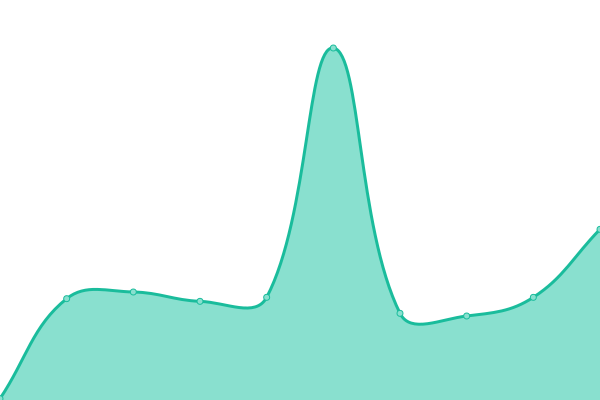

# [📈 Live Status](https://MatisPrograms.github.io/is-it-up): <!--live status--> **🟧 Partial outage**

This repository contains the open-source uptime monitor and status page for [Matis Herrmann](https://MatisPrograms.github.io/is-it-up), powered by [Upptime](https://github.com/upptime/upptime).

With [Upptime](https://upptime.js.org), you can get your own unlimited and free uptime monitor and status page, powered entirely by a GitHub repository. We use [Issues](https://github.com/MatisPrograms/is-it-up/issues) as incident reports, [Actions](https://github.com/MatisPrograms/is-it-up/actions) as uptime monitors, and [Pages](https://MatisPrograms.github.io/is-it-up) for the status page.

<!--start: status pages-->
<!-- This summary is generated by Upptime (https://github.com/upptime/upptime) -->
<!-- Do not edit this manually, your changes will be overwritten -->
<!-- prettier-ignore -->
| URL | Status | History | Response Time | Uptime |
| --- | ------ | ------- | ------------- | ------ |
|  [Google](https://www.google.com) | 🟩 Up | [google.yml](https://github.com/MatisPrograms/is-it-up/commits/HEAD/history/google.yml) | 

 116ms
     
 | 

<a href="https://MatisPrograms.github.io/is-it-up/history/google">100.00%</a>
    

|  [F1 Live Streams](https://live1.formula1stream.cc) | 🟩 Up | [f1-live-streams.yml](https://github.com/MatisPrograms/is-it-up/commits/HEAD/history/f1-live-streams.yml) | 

 1560ms
     
 | 

<a href="https://MatisPrograms.github.io/is-it-up/history/f1-live-streams">100.00%</a>
    

|  [Connect 4 Showdown](https://connect4.losherrmannos.duckdns.org) | 🟩 Up | [connect-4-showdown.yml](https://github.com/MatisPrograms/is-it-up/commits/HEAD/history/connect-4-showdown.yml) | 

 3405ms
     
 | 

<a href="https://MatisPrograms.github.io/is-it-up/history/connect-4-showdown">97.64%</a>
    

|  [Jellyfin](https://jellyfin.losherrmannos.duckdns.org) | 🟩 Up | [jellyfin.yml](https://github.com/MatisPrograms/is-it-up/commits/HEAD/history/jellyfin.yml) | 

 2914ms
     
 | 

<a href="https://MatisPrograms.github.io/is-it-up/history/jellyfin">98.23%</a>
    

|  [Asura Scans](https://asuracomic.net) | 🟥 Down | [asura-scans.yml](https://github.com/MatisPrograms/is-it-up/commits/HEAD/history/asura-scans.yml) | 

 303ms
     
 | 

<a href="https://MatisPrograms.github.io/is-it-up/history/asura-scans">29.82%</a>
    

|  [MangaKakalot](https://mangakakalot.com) | 🟥 Down | [manga-kakalot.yml](https://github.com/MatisPrograms/is-it-up/commits/HEAD/history/manga-kakalot.yml) | 

 0ms
     
 | 

<a href="https://MatisPrograms.github.io/is-it-up/history/manga-kakalot">0.00%</a>
    

|  [HiAnime!](https://hianime.to/) | 🟩 Up | [hi-anime.yml](https://github.com/MatisPrograms/is-it-up/commits/HEAD/history/hi-anime.yml) | 

 377ms
     
 | 

<a href="https://MatisPrograms.github.io/is-it-up/history/hi-anime">100.00%</a>
    

<!--end: status pages-->

[**Visit our status website →**](https://MatisPrograms.github.io/is-it-up)

## 📄 License

- Powered by: [Upptime](https://github.com/upptime/upptime)
- Code: [MIT](./LICENSE) © [Anand Chowdhary](https://anandchowdhary.com), supported by [Pabio](https://pabio.com)
- Data in the `./history` directory: [Open Database License](https://opendatacommons.org/licenses/odbl/1-0/)
